## Hello World 👋 Meu nome é Igor Natalino!

 
 Tenho 28 anos e atuo como <strong>Analista de Sistemas</strong>. 
Pós-graduado em Análise e Desenvolvimento de Sistemas e Engenharia de Software.  Trabalho focado em <strong>desenvolvimento de sistemas e automação de processos</strong>, criação de widgets no TOTVS Fluig, integrações com o Protheus, relatórios sobre SQL Server, portais web em Angular com NestJS.  Já entreguei desde automações de processos internos até um portal web completo, sempre com o mesmo objetivo: cortar etapa manual, reduzir retrabalho, devolver tempo para as áreas.  Apaixonado e sempre muito curioso por tecnologia, atualmente venho me desenvolvendo na área de IA, aplicando agentes ao dia a dia de TI. 

  🖥️  Conheça meu portfolio em https://igornatalino.github.io/Portfolio/ 
   ✉️ Fique a vontade para me contactar: <a href="mailto:igornatalino@gmail.com">igornatalino@gmail.com</a>

### 💻 Linguagens:

&nbsp;<a href="https://www.w3.org/TR/CSS/#css" target="_blank" rel="noreferrer">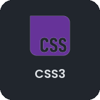</a>&nbsp;<a href="https://sass-lang.com/" target="_blank" rel="noreferrer">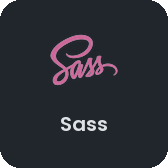</a>&nbsp;&nbsp;<a href="https://www.typescriptlang.org/" target="_blank" rel="noreferrer">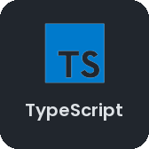</a>&nbsp;<a href="https://nodejs.org/en/" target="_blank" rel="noreferrer">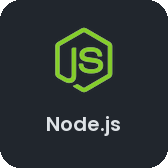</a>&nbsp;<a href="https://angular.dev/" target="_blank" rel="noreferrer">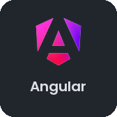</a>&nbsp;<a href="https://nestjs.com/" target="_blank" rel="noreferrer">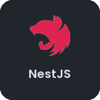</a>&nbsp;<a href="https://www.prisma.io/" target="_blank" rel="noreferrer">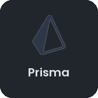</a>&nbsp;&nbsp;<a href="https://getbootstrap.com/" target="_blank" rel="noreferrer">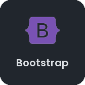</a>

### 🏢 Plataformas corporativas:

&nbsp;<a href="https://www.totvs.com/protheus/" target="_blank" rel="noreferrer">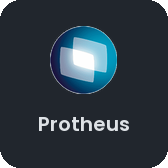</a>&nbsp;

### 💼 Ferramentas:

<a href="https://code.visualstudio.com/" target="_blank" rel="noreferrer">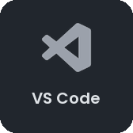</a>&nbsp;<a href="https://git-scm.com/" target="_blank" rel="noreferrer">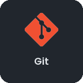</a>&nbsp;<a href="https://nginx.org/" target="_blank" rel="noreferrer">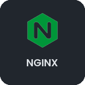</a>&nbsp;

### Midías

<a href="http://www.instagram.com/_natalino" target="_blank" rel="noreferrer"><picture><source media="(prefers-color-scheme: dark)" srcset="assets/icons/instagram-dark.svg" /><source media="(prefers-color-scheme: light)" srcset="assets/icons/instagram.svg" /></picture></a>&nbsp;&nbsp;<a href="https://www.linkedin.com/in/IgorNatalino" target="_blank" rel="noreferrer"><picture><source media="(prefers-color-scheme: dark)" srcset="assets/icons/linkedin-dark.svg" /><source media="(prefers-color-scheme: light)" srcset="assets/icons/linkedin.svg" /></picture></a>

### &lt;/Agradeço a Visita&gt;
